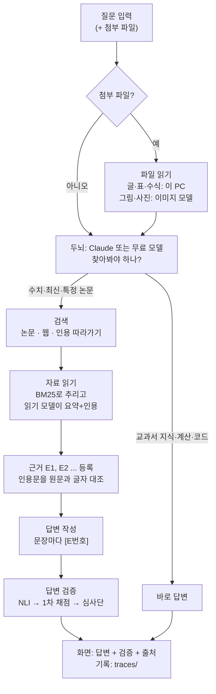
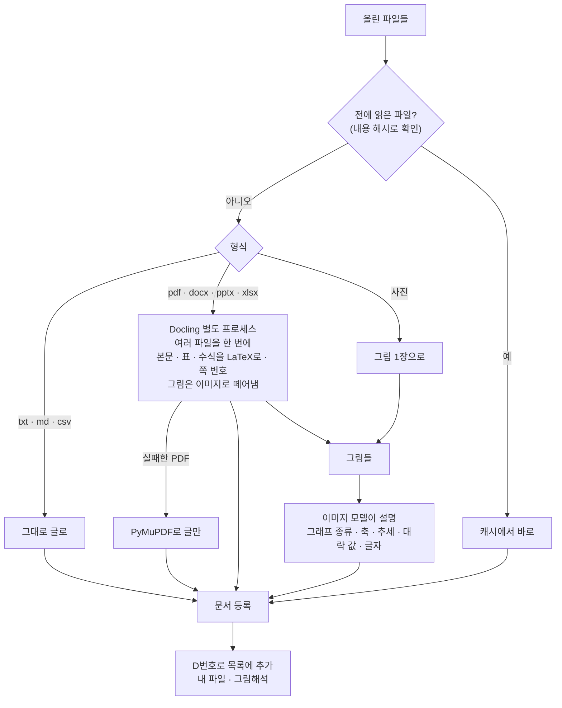
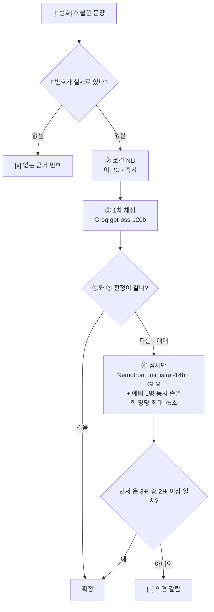

# 작동 흐름

질문 하나가 들어와서 답이 나가기까지, 파일을 올렸을 때, 답을 검증할 때 무슨 일이 일어나는지.
그리고 켜고, 점검하고, 고치는 법. 모든 설정은 [`models.yaml`](../models.yaml) 한 파일에 있어요.

## 켜기 (PowerShell)

항상 프로젝트 폴더에서 실행해요. 창을 닫으면 서버도 꺼져요.

| 명령 | 하는 일 |
|---|---|
| `.venv\Scripts\python -m research serve` | 채팅 화면. 브라우저에 localhost:8000이 열려요. 켤 때마다 캐시 자동 정리 |
| `.venv\Scripts\python -m research doctor` | API 키, 모델, 검색 API가 지금 작동하는지 점검. 이상하면 제일 먼저 |
| `.venv\Scripts\python -m research ask "질문" --file 논문.pdf --preset saver` | 화면 없이 질문 한 번. 모든 단계가 찍혀요. `--file`은 여러 번 가능 |
| `.venv\Scripts\python -m research clean [--all]` | 캐시와 오래된 기록 정리. `--all`은 모델만 남기고 전부 비움 |
| `.venv\Scripts\python -m research eval` | 채점 모델마다 정확도와 "같이 틀리는 정도" 측정. 모델을 바꾼 뒤에 |

## 전체 흐름

대화 담당 모델(두뇌)이 필요할 때만 도구를 불러요. 도구는 코드와 무료 모델이 맡고,
마지막에 답변 문장을 하나씩 검증해요.



## 질문 한 번: 화면에 보이는 순서

답변 위에 한 줄씩 쌓이는 단계예요. 줄을 누르면 입력, 사고 과정, 결과가 펼쳐져요.

1. **두뇌가 생각** — 검색이 필요한지, 뭘 찾을지. `✓ Claude sonnet 생각`
2. **검색** — 논문 API 세 곳(OpenAlex, Semantic Scholar, arXiv)이나 웹. 결과는 문서 번호 D1, D2 ...
   아직 근거가 아니라 후보. `✓ 논문 검색 · graphene thermal conductivity`
3. **자료 읽기** — 질문과 관련된 문단만 추리고, 읽기 모델이 문단마다 관련성·요약·원문 인용을 뽑아요.
   인용이 원문에 진짜 있는지 글자로 대조해서 통과한 것만 근거 E1, E2 ... `✓ 자료 읽기 · D2, D5`
4. **필요하면 반복** — 검색어를 바꾸거나 핵심 논문의 인용 관계를 따라가요. `✓ 인용 따라가기 · D2 citations`
5. **답변 작성** — 근거로만. 사실 문장마다 [E번호].
6. **답변 검증** — 아래 참고. `✓ 답변 검증`

이어지는 질문은 이미 모은 근거를 다시 써서 빨라요.
답변 아래 버튼: `걸린 문장 고치기` · `더 깊게` · `반론 찾기`

## 파일 올리기

PDF · DOCX · PPTX · XLSX · CSV · TXT · MD · 사진. 입력창 클립 버튼이나 끌어다 놓기.
한 번에 여러 개 가능. 같은 파일은 두 번째부터 바로 읽혀요.



| 작업 | 위치 | 시간 |
|---|---|---|
| PDF 글 · 표 · 수식 | 이 PC | 처음 한 번, 15쪽 논문 약 2~3분 |
| 그림 · 사진 설명 | 이미지 모델로 전송 (Mistral 우선) | 그림당 2~30초 |
| Claude 프리셋에서 올린 사진 | Claude가 직접 봄 | 대화에 포함 |
| 관련 부분 요약 · 채점 | 발췌만 무료 모델로 전송 | 질문마다 |

수식 변환을 끄면 3배 빨라지지만 수식이 사라져요: `models.yaml` → `files: formulas: false`

## 답변 검증

비싼 검사는 애매한 문장에만. 모델 여러 개가 같이 틀릴 수 있어서 서로 다른 회사 모델로 심사단을 꾸려요.



숫자가 들어 있는데 [E번호]가 없는 문장은 따로 `[?] 출처 없는 수치`로 표시해요.

## 모델 역할

역할마다 후보 목록이 있고, 앞의 모델이 실패하면 다음 모델로 자동으로 넘어가요.
한 번 실패한 모델은 잠시(2~30분) 건너뛰어요.

| 역할 | 하는 일 | 1순위 → 예비 |
|---|---|---|
| 두뇌 | 대화 · 검색 판단 · 답변 | 프리셋: Haiku · Sonnet · Opus (Claude 구독) / 무료 모델 프리셋: Nemotron → DeepSeek → Qwen |
| rcs (읽기) | 문단마다 관련성 · 요약 · 원문 인용 | ministral-14b → ministral-8b → DeepSeek |
| vision (그림) | 그림 · 사진 설명 | ministral-14b → Gemma-4 (NVIDIA) → Gemma-4 (OpenRouter) |
| first (1차 채점) | 모든 인용 문장 채점 | gpt-oss-120b → gpt-oss-20b (Groq) → gpt-oss-20b (NVIDIA) |
| jury (심사단) | 의견이 갈린 문장만 투표 | Nemotron · ministral-14b · GLM-5.3 / 예비: Gemma → Qwen → GLM-5.2 → DeepSeek |
| NLI | 근거가 문장을 뒷받침하나 | mDeBERTa 다국어 (이 PC) |

토큰을 아끼려면 Haiku, 어려운 추론은 Opus. 무료 모델 프리셋은 Claude 구독을 전혀 쓰지 않아요.

## 표시 읽기

| 표시 | 뜻 |
|---|---|
| `[ok]` | 근거가 문장을 뒷받침함 |
| `[~]` | 일부만 뒷받침 (수치 · 범위 · 날짜가 넘치거나 다름), 또는 심사단 의견이 갈림 |
| `[x]` | 근거에 없는 내용이거나 없는 근거 번호 |
| `[?]` | 검증 못 함 (채점 모델 없음) · 출처 없는 수치 |
| 원문일치 / 부분일치 | 근거로 쓴 인용문이 원문에 그대로 / 거의 그대로 있음 |
| 요약만 | 인용문이 원문과 안 맞아서 요약만 남김. 믿음 낮게 |
| 발췌 | 읽기 모델 없이 원문을 그대로 잘라 붙임 |
| 초록 · 그림해석 | 논문 전문을 못 구해 초록만 읽음 · 그림에서 읽은 값이라 근사치 |
| ✓ / ▸ | 단계 완료 / 진행 중 |

## 문제 해결

| 증상 | 원인 | 할 일 |
|---|---|---|
| "! 읽기 · 1차 채점 모델 없음" | .env에 키가 없거나 틀림 | `notepad .env`로 키 확인 → `doctor` |
| doctor에서 모델이 `x` | 무료 모델 종료 · 이름 변경 · 한도 초과 | models.yaml에서 그 줄을 바꾸거나 순서를 내림 → `eval`로 확인 |
| OpenRouter 429 | 무료 하루 50회 소진 | 다음 날 풀림. 예비라서 멈추진 않아요 |
| Semantic Scholar 429 | 익명 공용 한도 | 무료 키를 받아 .env의 `S2_API_KEY`에 |
| Mistral 큰 모델 429/403 | 무료 등급은 작은 모델만 | ministral 계열만 쓰기 (지금 설정) |
| NVIDIA 키 만료 | 유효기간 | 새 키 발급 → .env의 `NVIDIA_API_KEY` 교체 |
| Claude 시작 실패 | claude 로그인이 풀림 | 터미널에서 `claude` → `/login`, 또는 무료 모델 프리셋 |
| PDF가 너무 느림 | 수식 변환 모드 (처음 한 번) | 기다리거나 `formulas: false` |
| PDF 읽기 실패 | 스캔본 · 손상 파일 | 자동으로 PyMuPDF 재시도. 안 되면 다시 저장한 PDF로 |
| 답변이 느림 | 심사단 모델 응답 지연 | traces/ 기록에서 오래 걸린 단계 확인 → 그 모델을 예비로 내림 |
| 디스크가 찼음 | 캐시 · 기록 누적 | `clean` 또는 `clean --all`. 한도: `storage` |
| 포트 8000 사용 중 | 이미 켜져 있음 | `serve --port 8001` |

## 폴더 지도

```
custom_research_model/
├─ models.yaml        모든 설정: 프리셋 · 역할별 모델 · 심사단 · 파일 · 정리 한도
├─ .env               API 키 (git에 안 올라감)
├─ research/
│  ├─ app.py          채팅 화면 (Chainlit)
│  ├─ agents.py       두뇌: Claude(SDK) / 무료 모델(PydanticAI)
│  ├─ engine.py       도구: 검색 · 읽기 · 인용 따라가기 · 파일 등록
│  ├─ files.py        파일 읽기 · 그림 설명 · 캐시
│  ├─ docread.py      Docling 별도 프로세스 (한글 경로 우회)
│  ├─ judge.py        답변 검증 (NLI · 1차 · 심사단)
│  ├─ llm.py          무료 모델 호출 · 자동 전환 · 잠시 제외
│  ├─ sources.py      논문 API · 웹 검색 · 페이지 받기
│  ├─ prompts.py      모델에게 주는 지시문
│  ├─ cleanup.py      캐시 정리
│  └─ doctor.py · evaluate.py
├─ eval/claims.jsonl  채점 모델 테스트 문장 (추가 가능)
├─ traces/            대화마다 전체 기록 (30일 보관)
├─ .cache/files/      읽은 파일 (2GB 넘으면 오래된 것부터 삭제)
├─ .cache/docs/       받아온 웹페이지 · 논문 (30일)
├─ .cache/hf/         로컬 모델 약 1.1GB (정리 대상 아님)
└─ public/ · .chainlit/  화면 색 · 글꼴 · 문구
```
